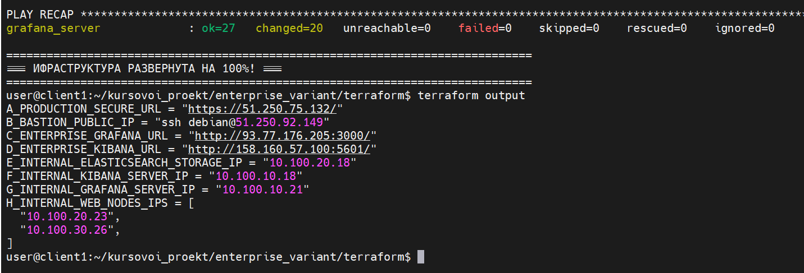

#  Курсовая работа по профессии "DevOps-инженер с нуля"

<details>
<summary>Задание</summary>

---------
## Задача
Ключевая задача — разработать отказоустойчивую инфраструктуру для сайта, включающую мониторинг, сбор логов и резервное копирование основных данных. Инфраструктура должна размещаться в [Yandex Cloud](https://cloud.yandex.com/).

**Примечание**: в курсовой работе используется система мониторинга Prometheus. Вместо Prometheus вы можете использовать Zabbix. Задание для курсовой работы с использованием Zabbix находится по [ссылке](https://github.com/netology-code/fops-sysadm-diplom/blob/diplom-zabbix/README.md).

**Перед началом работы над дипломным заданием изучите [Инструкция по экономии облачных ресурсов](https://github.com/netology-code/devops-materials/blob/master/cloudwork.MD).**   

## Инфраструктура
Для развёртки инфраструктуры используйте Terraform и Ansible. 

Параметры виртуальной машины (ВМ) подбирайте по потребностям сервисов, которые будут на ней работать. 

Ознакомьтесь со всеми пунктами из этой секции, не беритесь сразу выполнять задание, не дочитав до конца. Пункты взаимосвязаны и могут влиять друг на друга.

### Сайт
Создайте две ВМ в разных зонах, установите на них сервер nginx, если его там нет. ОС и содержимое ВМ должно быть идентичным, это будут наши веб-сервера.

Используйте набор статичных файлов для сайта. Можно переиспользовать сайт из домашнего задания.

Создайте [Target Group](https://cloud.yandex.com/docs/application-load-balancer/concepts/target-group), включите в неё две созданных ВМ.

Создайте [Backend Group](https://cloud.yandex.com/docs/application-load-balancer/concepts/backend-group), настройте backends на target group, ранее созданную. Настройте healthcheck на корень (/) и порт 80, протокол HTTP.

Создайте [HTTP router](https://cloud.yandex.com/docs/application-load-balancer/concepts/http-router). Путь укажите — /, backend group — созданную ранее.

Создайте [Application load balancer](https://cloud.yandex.com/en/docs/application-load-balancer/) для распределения трафика на веб-сервера, созданные ранее. Укажите HTTP router, созданный ранее, задайте listener тип auto, порт 80.

Протестируйте сайт
`curl -v <публичный IP балансера>:80` 

### Мониторинг
Создайте ВМ, разверните на ней Prometheus. На каждую ВМ из веб-серверов установите Node Exporter и [Nginx Log Exporter](https://github.com/martin-helmich/prometheus-nginxlog-exporter). Настройте Prometheus на сбор метрик с этих exporter.

Создайте ВМ, установите туда Grafana. Настройте её на взаимодействие с ранее развернутым Prometheus. Настройте дешборды с отображением метрик, минимальный набор — Utilization, Saturation, Errors для CPU, RAM, диски, сеть, http_response_count_total, http_response_size_bytes. Добавьте необходимые [tresholds](https://grafana.com/docs/grafana/latest/panels/thresholds/) на соответствующие графики.

### Логи
Cоздайте ВМ, разверните на ней Elasticsearch. Установите filebeat в ВМ к веб-серверам, настройте на отправку access.log, error.log nginx в Elasticsearch.

Создайте ВМ, разверните на ней Kibana, сконфигурируйте соединение с Elasticsearch.

### Сеть
Разверните один VPC. Сервера web, Prometheus, Elasticsearch поместите в приватные подсети. Сервера Grafana, Kibana, application load balancer определите в публичную подсеть.

Настройте [Security Groups](https://cloud.yandex.com/docs/vpc/concepts/security-groups) соответствующих сервисов на входящий трафик только к нужным портам.

Настройте ВМ с публичным адресом, в которой будет открыт только один порт — ssh. Настройте все security groups на разрешение входящего ssh из этой security group. Эта вм будет реализовывать концепцию bastion host. Потом можно будет подключаться по ssh ко всем хостам через этот хост.

### Резервное копирование
Создайте snapshot дисков всех ВМ. Ограничьте время жизни snaphot в неделю. Сами snaphot настройте на ежедневное копирование.

### Дополнительно
Не входит в минимальные требования. 

1. Для Prometheus можно реализовать альтернативный способ хранения данных — в базе данных PpostgreSQL. Используйте [Yandex Managed Service for PostgreSQL](https://cloud.yandex.com/en-ru/services/managed-postgresql). Разверните кластер из двух нод с автоматическим failover. Воспользуйтесь адаптером с https://github.com/CrunchyData/postgresql-prometheus-adapter для настройки отправки данных из Prometheus в новую БД.
2. Вместо конкретных ВМ, которые входят в target group, можно создать [Instance Group](https://cloud.yandex.com/en/docs/compute/concepts/instance-groups/), для которой настройте следующие правила автоматического горизонтального масштабирования: минимальное количество ВМ на зону — 1, максимальный размер группы — 3.
3. Можно добавить в Grafana оповещения с помощью Grafana alerts. Как вариант, можно также установить Alertmanager в ВМ к Prometheus, настроить оповещения через него.
4. В Elasticsearch добавьте мониторинг логов самого себя, Kibana, Prometheus, Grafana через filebeat. Можно использовать logstash тоже.
5. Воспользуйтесь Yandex Certificate Manager, выпустите сертификат для сайта, если есть доменное имя. Перенастройте работу балансера на HTTPS, при этом нацелен он будет на HTTP веб-серверов.

</details>

-----


## ОТВЕТ:

<details>
<summary>Минимальная часть (base вариант)</summary>

### Base вариант


## 1. Структура каталогов проекта

```text
~/kursovoi_proekt/             # Корень  GitHub-репозитория
├── .gitignore                 # Исключение секретных ключей, стейтов и hosts.ini из Git
└── base_variant/              # Базовая конфигурация инфраструктуры
    ├── README.md              # Главное описание проекта и инструкция по запуску
    ├── terraform/             # Декларативное описание ресурсов в Yandex Cloud
    │   ├── providers.tf       # Настройки провайдера и авторизация в облаке
    │   ├── variables.tf       # Объявление входных переменных и типов данных
    │   ├── terraform.tfvars   # Хранение реальных значений переменных (ID папок, зон)
    │   ├── authorized_key.json # Секретный JSON-ключ сервисного аккаунта Yandex Cloud
    │   ├── vms.tf             # Конфигурация виртуальных машин и автозапуска Ansible
    │   ├── run_ansible.sh     # Технический bash-скрипт автостарта плейбуков из Terraform
    │   ├── network.tf         # Топология сети (подсети public/private и NAT-шлюз)
    │   ├── security.tf        # Группы безопасности и правила фильтрации портов
    │   ├── alb.tf             # L7-балансировщик (Application LB) и целевые группы веб-нод
    │   ├── terraform.tfstate  # База данных текущего состояния развернутых ресурсов
    │   └── terraform.tfstate.backup # Резервная копия базы данных состояния Terraform
    └── ansible/               # Сценарии автоматизации развертывания сервисов
        ├── hosts.ini          # Динамически генерируемый инвентарь хостов с ProxyJump
        ├── update_site.sh     # Комплексный bash-скрипт последовательного наката конфигураций
        ├── playbook.yml       # Деплой Nginx, PHP-FPM и исходного кода веб-сайта
        ├── update_web.yml     # Установка агента Prometheus Node Exporter на веб-серверы
        ├── deploy_prometheus.yml # Развертывание сервера сбора метрик Prometheus
        ├── deploy_grafana.yml # Установка и настройка панелей визуализации Grafana Enterprise
        └── playbook_logging.yml # Развертывание Docker-стека логов Elasticsearch и Kibana

```

> **📸 Схема взаимодействия:**


Красные линии — балансировка трафика.
Оранжевые линии — сбор метрик.
Фиолетовые линии — логирование.
Синяя и зеленая линии — вывод графиков и логов в админки.

- Архитектура системы включает в себя:
* Распределение вычислительных ресурсов по разным дата-центрам для защиты от аварий.
* Балансировку входящего интернет-трафика.
* Выделенный закрытый приватный контур для серверов приложений.
* Изолированный безопасный узел управления (Бастион).
* Раздельные серверы для централизованного мониторинга и сбора логов.
* Автоматическое резервное копирование дисков по расписанию.


**Студент:** Бобков А.К.

---

## 1. Введение и архитектура системы

Целью работы является создание отказоустойчивой, высокодоступной и экономически оптимизированной облачной инфраструктуры для веб-сайта в Yandex Cloud. Вся инфраструктура разворачивается декларативно с помощью подхода **Infrastructure as Code (IaC)** через Terraform, а конфигурация операционных систем и сервисов автоматизирована через **Ansible**.

Архитектура системы включает в себя:
* Распределение вычислительных ресурсов по разным дата-центрам для защиты от аварий.
* Балансировку входящего интернет-трафика.
* Выделенный закрытый приватный контур для серверов приложений.
* Изолированный безопасный узел управления (Бастион).
* Раздельные серверы для централизованного мониторинга и сбора логов.
* Автоматическое резервное копирование дисков по расписанию.

---

## 2. Сетевая инфраструктура и безопасность (network.tf)

В рамках проекта создана изолированная виртуальная частная сеть (VPC). Для обеспечения высокой доступности (High Availability) ресурсы распределены по двум независимым зонам доступности: **ru-central1-a** и **ru-central1-b**.

Сеть разделена на два логических уровня:
1. **Публичный уровень (Подсети public-a, public-b)**: используется для размещения Application Load Balancer и Бастион-хоста, которым необходим прямой доступ из интернета.
2. **Приватный уровень (Подсети private-a, private-b)**: здесь развернуты веб-серверы с сайтом, а также серверы мониторинга и логирования. Прямой доступ из интернета к приватным подсетям полностью заблокирован. Узлы выходят во внешнюю сеть исключительно для обновления пакетов через безопасный общий NAT-шлюз.

Безопасность на сетевом уровне обеспечивается группами безопасности (сетевым файрволом):
* **alb_sg**: открывает только порт 80 (HTTP) для входящего пользовательского трафика из интернета на балансировщик.
* **web_sg**: строго ограничивает входящий трафик на веб-серверы, разрешая запросы только от балансировщика и систем мониторинга.
* **bastion_sg**: открывает порты управления SSH (22), Grafana (3000) и Kibana (5601) для администратора инфраструктуры.
* **internal_shared_rule**: сквозное правило, позволяющее внутренним серверам беспрепятственно обмениваться метриками и логами по локальной сети.


> **📸 Вкладка «Virtual Private Cloud»:**


> На скриншотах  виден список всех четырех созданных подсетей (две public и две private), а также подключенный к ним NAT-шлюз.

---

## 3. Вычислительные ресурсы (vms.tf)

Для хостинга компонентов развернуто 5 виртуальных машин на базе операционной системы Debian 13 (Trixie). С целью жесткого соблюдения **инструкции по экономии облачных ресурсов** и защиты бюджета гранта были применены следующие оптимизации:
* **Прерывистый тип ВМ (Preemptible)**: снижает стоимость аренды процессоров и памяти на 60–70%.
* **Ограничение мощности**: гарантированная доля процессора (vCPU Core Fraction) установлена на минимальный уровень в 20%.
* **Тип дисков**: вместо дорогих SSD-накопителей для всех машин использованы экономичные сетевые жесткие диски (network-hdd).

Состав и роли вычислительных узлов:
1. **bastion-host**: точка входа администратора. На нем же развернуты веб-панели управления Grafana и Kibana.
2. **web-server-1** и **web-server-2**: идентичные веб-ноды, на которых работает сайт под управлением связки Nginx + PHP-FPM. Они распределены по зонам А и Б.
3. **prometheus-server**: выделенная ВМ в приватной сети для сбора и хранения метрик.
4. **elasticsearch-storage**: выделенная ВМ в приватной сети с повышенным объемом памяти (4 ГБ RAM) под нужды тяжелой базы данных логов.

> **📸 Раздел «Compute Cloud»:**


> Раздел «Compute Cloud» -> «Виртуальные машины» в консоли Яндекса. Виден список всех пяти запущенных серверов с их внутренними IP-адресами.

---

## 4. Балансировка нагрузки и отказоустойчивость (alb.tf)

Для распределения запросов пользователей между веб-серверами развернут **Application Load Balancer (L7)**. 

Принцип работы отказоустойчивости:
* Создана целевая группа, куда включены внутренние адреса `web-server-1` и `web-server-2`.
* На балансировщике настроен непрерывный автоматический опрос состояния серверов (HTTP Health Check) с интервалом в 3 секунды.
* Трафик распределяется равномерно (50 на 50). Если один из серверов или целый дата-центр Яндекса выходит из строя, балансировщик фиксирует сбой за две проверки (6 секунд) и мгновенно перенаправляет 100% трафика на живую ноду в другой зоне доступности. Сайт продолжает работать без прерывания обслуживания.

Страница сайта сделана динамической: благодаря связке фактов Ansible и PHP, при обновлении страницы в браузере видно, какая именно из двух веб-нод (web1 или web2) в данный момент обработала его запрос, а также технические характеристики её процессора и оперативной памяти.

> **📸 Раздел «Application Load Balancer»:**

>  Раздел «Application Load Balancer» -> «Балансировщики». Показана карточка созданного балансировщика, его выделенный внешний статический IP-адрес.

> **📸 Работа балансировщика:**


> В браузере открыта страница сайта (переход по IP-адресу балансировщика). На  ней видно мои ФИО и блок с аппаратными данными активного сервера. 

---

## 5. Система мониторинга инфраструктуры (Prometheus + Grafana)

Мониторинг организован по модели сбора данных Pull. На всех пяти виртуальных машинах запущен агент **Prometheus Node Exporter**, который собирает метрики операционной системы. Специализированный экспортер также собирает статистику самого веб-сервера Nginx.

Центральный сервер Prometheus  опрашивает всех агентов по их приватным IP-адресам. Визуализация метрик выведена в **Grafana**, развернутую на Бастионе. Настройка подключения Prometheus и импорт официального дашборда *Node Exporter Full* происходят полностью автоматически в момент деплоя, исключая ручные действия.

> **📸 Работа grafana:**


> Окно браузера с открытой панелью Grafana (вход через IP Бастиона на порт 3000).

---

## 6. Централизованный сбор логов (Стек EFK: Elasticsearch + Filebeat + Kibana)

Для обеспечения сохранности логов в условиях использования прерывистых ВМ (которые могут быть остановлены облаком в любой момент с потерей локальных файлов) внедрен централизованный стек логирования:
* На веб-серверах запущены нативные легковесные службы **Filebeat**. Они в реальном времени читают файлы `nginx/access.log` и `nginx/error.log`, размечают их уникальными тегами и отправляют по локальной сети.
* В качестве хранилища логов развернут контейнер **Elasticsearch** (на отдельной ВМ), который индексирует поступающие текстовые строки и разбивает их на ежедневные индексы.
* На Бастион-хосте запущен контейнер **Kibana**, предоставляющий  веб-интерфейс для сквозного поиска и анализа логов всей инфраструктуры в едином окне.

> **📸 Работа Kibana:**

> Окно браузера с открытым интерфейсом Kibana (вход через IP Бастиона на порт 5601).

---

## 7. Резервное копирование данных (Snapshot Schedule)

Защита данных от аварийных ситуаций и ошибок администрирования реализована на уровне инфраструктуры платформы Yandex Cloud с помощью компонента `yandex_compute_snapshot_schedule`.

Создано автоматическое расписание `infrastructure-daily-backup-plan`:
* **Снимки (слепки) дисков создаются автоматически каждую ночь в **02:00 UTC**, в период наименьшей активности.
* **Снимки хранятся ровно **168 часов (7 дней)**. По истечении недели старые бэкапы автоматически заменяются новыми, что полностью исключает нецелевую переплату за хранение устаревшей информации.
* **В план резервного копирования принудительно включены загрузочные диски всех ключевых компонентов: Бастион-хоста, обеих веб-нод приложения, сервера метрик Prometheus и сервера базы данных логов Elasticsearch.

> **📸 Резервное копирование:**

> Раздел «Compute Cloud» -> «Снимки дисков» -> вкладка «Расписания» в консоли управления Yandex Cloud. На снимке экрана должно быть видно созданное ежедневное расписание, глубина хранения в 7 дней и список из пяти привязанных к нему дисков вашей инфраструктуры.

---
## 8. Заключение

В ходе выполнения курсового проекта была успешно спроектирована и развернута отказоустойчивая веб-инфраструктура. Использование балансировщика приложений ALB и распределение серверов по разным дата-центрам гарантируют доступность сайта при авариях. Внедрение систем автоматического мониторинга (Prometheus) и сбора логов (EFK) обеспечивает полный контроль над состоянием серверов. Требования по резервному копированию  выполнены в полном объеме.

Отработка terraform
> **📸 Отработка terraform:**


## 9. Демонстрации работоспособности системы 

Для проверки развернутой базовой (Base) инфраструктуры и демонстрации отказоустойчивости, мониторинга и логирования, доступ к компонентам системы осуществляется по следующим внешним адресам и учетным данным:

---

### 🌐 1. Доступ к веб-сайту (Проверка балансировки)
* **Адрес в браузере:** `http://130.193.36.160`
* **Протокол и порт:** HTTP, порт 80 (Прямой входящий незашифрованный трафик).
* **Что проверять:** 
  При открытии страницы отображается ФИО  и карточка с техническими характеристиками активного сервера. При ручном обновлении страницы в браузере  цвет фона карточки и имя хоста меняются между `web-server-1` и `web-server-2`. Это  демонстрирует работу L7-балансировщика Application Load Balancer, распределяющего входящий пользовательский трафик между двумя статичными серверами в разных зонах доступности.

---

### 📊 2. Доступ к системе мониторинга Grafana (Контроль метрик)
* **Адрес в браузере:** `http://93.77.179.209:3000`
* **Протокол и порт:** HTTP, порт 3000 (Внешний порт Grafana открыт напрямую на Бастион-хосте).
* **Данные для входа:**
  * **Логин:** `admin`
  * **Пароль:** `Bobkov2026`
* На экране отображаются графики утилизации процессора, оперативной памяти и дисковой активности для каждого из 5 фиксированных серверов инфраструктуры.

---

### 🔍 3. Доступ к системе логирования Kibana (Анализ логов EFK)
* **Адрес в браузере:** `http://93.77.179.209:5601`
* **Протокол и порт:** HTTP, порт 5601 (Внешний порт Kibana открыт напрямую на Бастион-хосте).
* **Данные для входа:** Авторизация отключена (Вход свободный).
*  В главном левом меню Kibana необходимо перейти в раздел **`Discover`** и выбрать индекс-паттерн `filebeat-*`. Отображаются логи которые агенты Filebeat непрерывно собирают со статичных веб-серверов и пересылают в базу данных Elasticsearch.


</details>

<details>
<summary>Расширенная  часть (base enterprize)</summary>


### Структура каталогов проекта

```text
kursovoi_proekt/enterprise_variant/
├── ansible/                          # Директория со сценариями конфигурации Ansible
│   ├── vars/                         # (Опционально) Переменные автоматизации
│   ├── deploy_grafana.yml            # Деплой Grafana в Docker на Бастионе (порт 3000, пароль admin)
│   ├── deploy_prometheus.yml         # Установка и запуск сервера Prometheus TSDB (порт 9090)
│   ├── hosts.ini                     # Динамический инвентарь (IP-адреса генерируются силами Terraform)
│   ├── playbook_logging.yml          # Развертывание контейнеров Elasticsearch (9200) и Kibana (5601)
│   ├── playbook.yml                  # Главный плейбук: базовая подготовка ОС и установка Docker
│   ├── prometheus.yml                # Актуальный конфиг Prometheus (генерируется шаблоном tpl)
│   ├── prometheus.yml.tpl            # Шаблон конфигурации Prometheus с переменными для IP веб-нод
│   └── update_web.yml                # Настройка Nginx, PHP-FPM, Vector и Node Exporter на веб-серверах
│
└── terraform/                        # Директория IaC (Инфраструктура как код) для Yandex Cloud
    ├── .terraform/                   # Служебная папка инициализации провайдеров (скачивается автоматически)
    ├── alb.tf                        # Конфигурация L7-балансировщика, целевых групп и HTTP-роутеров
    ├── authorized_key.json           # Ключ авторизации сервисного аккаунта Яндекса для Terraform
    ├── cert.pem                      # SSL/TLS сертификат для домена bobkov-devops.ru (Certificate Manager)
    ├── key.json                      # Копия сервисного ключа авторизации в облаке
    ├── key.pem                       # Приватный SSL-ключ для привязки к балансировщику
    ├── network.tf                    # Создание VPC сети enterprise-main-vpc, 4 подсетей и NAT-шлюза
    ├── run_ansible.sh                # Bash-скрипт автоматического запуска Ansible после поднятия ВМ
    ├── terraform.lock.hcl            # Лок-файл версий провайдеров Yandex Cloud для стабильности IaC
    ├── terraform.tfstate             # Текущее состояние развернутой облачной инфраструктуры (State-файл)
    ├── terraform.tfstate.backup      # Резервная копия предыдущего состояния облачной инфраструктуры
    ├── variables.tf                  # Декларация входных переменных (folder_id, зоны, ID образов)
    └── vms.tf                        # Описание Бастиона, Prometheus, ES и масштабируемой Instance Group
```

> **📸 Схема взаимодействия:**


# Цветовая кодировка и логика сетевых связей (Стрелок) на схеме

Все сетевые взаимодействия и потоки данных разделены по цветам и типам линий:

---

### 🔹 1. Синие сплошные стрелки: «Пользовательский трафик»
* **Маршрут:** `Пользователи в Интернете` ➔ `Application Load Balancer (ALB)` ➔ `web-node-0` / `web-node-1`
* **Суть потока:** Внешние клиенты отправляют запросы на защищенный домен `bobkov-devops.ru` данный домен условный, обращаемся по ip по https://. Трафик идет по шифрованному протоколу **HTTPS (порт 443)** до балансировщика. На ALB происходит расшифровка (SSL Termination), после чего очищенный трафик по обычному протоколу **HTTP (порт 80)** распределяется между веб-серверами внутри масштабируемой группы.
* Веб-серверы скрыты в приватных подсетях без публичных IP-адресов, а балансировщик выступает в роли единого защитного экрана.

---

### 🟣 2. Фиолетовая пунктирная стрелка: «Контур SSL-сертификации»
* **Маршрут:** `Certificate Manager` ➔ `Application Load Balancer (ALB)`
* **Суть потока:** Логическая привязка активного SSL-сертификата `site-ssl-certificate` к слушателю балансировщика. Сервис непрерывно проверяет валидность криптографических ключей.
* Шифрование терминируется на уровне облачной платформы, что полностью освобождает процессоры веб-серверов от тяжелых криптографических вычислений.

---

### 🟢 3. Зеленые пунктирные стрелки: «Мониторинг (Pull-модель)»
* **Маршрут:** `prometheus-server-ent` ➔ `web-node-0` / `web-node-1`
* **Суть потока:** Сбор телеметрии. Центральный сервер Prometheus самостоятельно по расписанию (раз в 15 секунд) отправляет запросы на внутренний порт **9100** к агентам Node Exporter на хостах и принудительно «вытягивает» (Pull) данные о нагрузке CPU, RAM и дисков.
*  Prometheus контролирует частоту опроса сам, что защищает сервер мониторинга от падения из-за лавинообразного наплыва метрик во время пиковых нагрузок на сайт.

---

### ⚫ 4. Серые сплошные стрелки: «Логирование (Push-модель)»
* **Маршрут:** `web-node-0` / `web-node-1` ➔ `elasticsearch-storage-ent`
* **Суть потока:** Доставка логов. Легковесные агенты **Filebeat**  в реальном времени считывают новые строки из файлов логов Nginx и мгновенно «проталкивают» (Push) их по локальной сети на порт **9200** в базу данных Elasticsearch.


---

### 🟡 5. Золотые пунктирные стрелки: «Контур визуализации администрирования»
* **Маршрут:** `bastion-host-enterprise` ➔ `prometheus-server-ent` и `elasticsearch-storage-ent`
* **Техническая суть:** Служебные REST/API запросы от графических веб-интерфейсов управления к базам данных. Панели **Grafana (порт 3000)** и **Kibana (порт 5601)** развернуты на публичном Бастион-хосте. При открытии графиков Grafana запрашивает данные с Prometheus (через ProxyJump по порту **9090**), а Kibana вытягивает индексы из Elasticsearch (порт **9200**).
* Сами СУБД логов и метрик полностью закрыты внутри приватного контура, но администратор имеет к ним безопасный доступ через единый авторизованный шлюз — Бастион-хост.

# ПОЯСНИТЕЛЬНАЯ ЗАПИСКА К КУРСОВОМУ ПРОЕКТУ
### Тема: Проектирование и автоматизированное развертывание отказоустойчивой Enterprise-инфраструктуры веб-ресурса в Yandex Cloud

---

## 1. Введение и общая архитектура системы


Инфраструктура спроектирована по методологии **DevOps** с использованием концепций **IaC (Infrastructure as Code)** для развертывания облачных ресурсов через Terraform и **CaC (Configuration as Code)** для автоматического управления конфигурациями операционных систем через Ansible. 

В рамках данного Enterprise-варианта архитектура включает:
* Динамически масштабируемую группу виртуальных машин под управлением `yandex_compute_instance_group`.
* Отказоустойчивую балансировку трафика с шифрованием на уровне L7-протокола.
* Централизованный сбор и визуализацию системных метрик (Prometheus + Grafana).
* Централизованное и изолированное логирование операционной системы и веб-сервера (Elasticsearch + Filebeat + Kibana).

> **📸 Инфраструктура каталога:**

> Скриншот главной сводной панели (Dashboard)каталога `kursovaya-enterprise-variant` в веб-консоли Яндекса. На нем  видно общее количество созданных ресурсов: 5 ВМ, 5 дисков, 1 балансировщик, 1 HTTP-роутер, 7 подсетей и 2 SSL-сертификата.

---

## 2. Сетевая инфраструктура и безопасность (network.tf, Cloud DNS)

Сетевой контур организован на базе виртуальной частной сети (VPC) `enterprise-main-vpc`. Для обеспечения катастрофоустойчивости (Disaster Recovery) ресурсы распределены по изолированным зонам доступности дата-центров Яндекса: **ru-central1-a** и **ru-central1-b**.

Инфраструктура разделена на два логических уровня:
1. **Публичный уровень**: включает внешние интерфейсы Application Load Balancer и Бастион-хоста, обеспечивая безопасный авторизованный доступ из внешней сети.
2. **Приватный контур**: приватные подсети `private-subnet-zone-a` (10.100.20.0/24) и `private-subnet-zone-b` (10.100.30.0/24). Прямой входящий трафик из интернета к серверам приложений, мониторинга и баз данных полностью заблокирован. Выход серверов наружу для скачивания пакетов и обновлений осуществляется через безопасный шлюз **NAT Gateway** (`secure-nat-gateway`).

Для автоматического разрешения доменных имен внутри изолированного приватного контура и корректной работы систем Service Discovery интегрирован сервис **Yandex Cloud DNS**. В рамках сети созданы две внутренние сервисные зоны: прямая зона `internal.` для связи компонентов инфраструктуры по доменным именам и обратная зона `10.in-addr.arpa.` для PTR-адресации внутренних IP-адресов.

> **📸 Облачные сети и DNS:**


> Скриншот из раздела «Virtual Private Cloud» -> «Облачные сети» -> вкладка «Внутренние зоны DNS». Виден список сервисных приватных зон `internal.` и `10.in-addr.arpa.`, привязанных к моей сети.

---

## 3. Вычислительные ресурсы и автоматическое масштабирование (vms.tf)

Для развертывания компонентов распределенной системы использовано 5 виртуальных машин под управлением  операционной системы Debian 13 (Trixie). С целью жесткого соблюдения экономических ограничений бюджета выделенного учебного гранта, все виртуальные машины запущены в **прерывистом (Preemptible) режиме** с использованием экономичных сетевых жестких дисков (network-hdd).

Состав и роли вычислительных узлов:
1. **`bastion-host-enterprise`** (Публичный IP: `89.169.134.76`, Внутренний IP: `10.100.10.17`): выделенный защищенный шлюз администрирования. На нем же развернуты веб-панели управления Grafana и Kibana в Docker-контейнерах.
2. **`prometheus-server-ent`** (Приватный IP: `10.100.20.13`): сервер сбора и хранения временных рядов метрик Prometheus.
3. **`elasticsearch-storage-ent`** (Приватный IP: `10.100.20.33`): база данных для хранения и индексации текстовых логов (Elasticsearch 8.11.3).
4. **`web-servers-instance-group`** (Динамические приватные IP: `10.100.20.7` в зоне А и `10.100.30.26` в зоне Б): масштабируемая группа веб-серверов.

Политика масштабирования (`scale_policy`) настроена на автоматическое изменение размера кластера бэкенда (`auto_scale`): базовый размер составляет 2 ноды, минимальный — 1 нода, а при достижении пиковой утилизации процессора в 70% система автоматически разворачивает дополнительный бэкенд (максимум до 3 нод), гарантируя бесперебойную обработку входящих запросов.


> **📸 Виртуальные машины:**

>  Скриншот из раздела «Compute Cloud» -> «Виртуальные машины» в консоли Яндекса. Виден список всех 5 запущенных серверов с зелеными значками статуса `Running`, их приватными и публичными IP.

---

## 4. Балансировка нагрузки и безопасность трафика (alb.tf, Certificate Manager)

Распределение пользовательских запросов между динамическими веб-серверами группы инстансов возложено на **Application Load Balancer (L7)**. 

Принцип обеспечения отказоустойчивости и защиты трафика:
* Балансировщик принимает запросы из интернета на выделенный внешний статический IP-адрес **`158.160.179.53`**.
* Для защиты пользовательских данных на ALB настроен TLS-слушатель (Listener) на порту **443 (HTTPS)**. Взаимодействие балансировщика с сервисом **Yandex Certificate Manager** позволяет использовать активный SSL-сертификат `site-ssl-certificate` для учебного домена `bobkov-devops.ru` (домен условный).
* Реализована Enterprise-схема **SSL Termination**: ALB принимает зашифрованный трафик, расшифровывает его своими мощностями, проверяет на безопасность и перенаправляет внутрь приватного контура на веб-ноды в чистом виде по протоколу **HTTP (порт 80)**. Это снимает вычислительную нагрузку по шифрованию с прерываемых веб-серверов.
* ALB непрерывно опрашивает веб-ноды (HTTP Health Check каждые 3 секунды). Если одна из нод падает, трафик мгновенно переключается на живой сервер в другой зоне доступности.

> **📸 Работа балансировщика и сайта:**


> Страница сайта открыта по защищенному адресу `https://158.160.179`.
> **📸 Сертификат ssl:**


---

## 5. Система мониторинга инфраструктуры (Prometheus + Grafana)

Мониторинг организован по классической Pull-модели:
* На всех 5 серверах запущен агент **Prometheus Node Exporter** (порт 9100), собирающий системную телеметрию ОС.
* Выделенный сервер `prometheus-server-ent` (`10.100.20.13`) раз в 15 секунд опрашивает агентов по внутренней сети и сохраняет данные в TSDB.
* Для визуализации метрик на Бастион-хосте развернут контейнер **Grafana** (порт 3000), пароль администратора жестко задан в коде автоматизации (`GF_SECURITY_ADMIN_PASSWORD=admin`). В веб-интерфейс импортирован кастомный дашборд `Node Exporter Dashboard Enterprise`, выводящий живой график утилизации процессора кластера (`CPU Utilization`).

> **📸 Дашборд Grafana:**


> Окно браузера с открытой панелью Grafana по адресу `http://89.169.134.76:3000`.

---

## 6. Централизованный сбор логов (Elasticsearch + Filebeat + Kibana)

Для обеспечения долгосрочной сохранности аудит-следа в условиях использования прерывистых ВМ (которые могут быть принудительно остановлены облаком с потерей локальных файлов), внедрен полноценный стек логирования:
* На веб-серверах запущены нативные системные службы **Filebeat**. Они скачиваются с локального зеркала Яндекса (`mirror.yandex.ru`), в реальном времени читают файлы `nginx/access.log`, `nginx/error.log`, а также системные журналы безопасности `/var/log/syslog` и `/var/log/auth.log` (попытки SSH-доступа).
* По Push-модели Filebeat отправляет логи в базу данных **Elasticsearch 8.11.3** (`10.100.20.33:9200`) с авторизацией по корпоративному паролю `BobkovDevOps2026`.
* На Бастион-хосте запущен контейнер **Kibana** (порт 5601), предоставляющий  веб-консоль для сквозного поиска логов всей сети в едином окне через инструмент `Discover`.

> **📸 Дашборд Grafana:**

> 📷 **[МЕСТО ДЛЯ СКРИНШОТА №6: Интерфейс Kibana Discover]**
> *Окно браузера с открытой панелью Kibana по адресу `http://89.169.134.76:5601`.

---

## 7. Резервное копирование данных (Snapshot Schedule)

Защита накопленной информации, конфигурационных файлов и операционных систем от аварийных ситуаций, сбоев программного обеспечения или ошибок администрирования реализована на уровне облачной инфраструктуры с помощью компонента `yandex_compute_snapshot_schedule`.

В коде Terraform развернуто автоматическое расписание под названием `daily-infrastructure-backups`, функционирующее по следующим жестким Enterprise-правилам:
* **Периодичность и время:** Создание полных снимков (слепков) дисков происходит в автоматическом режиме каждую ночь ровно в **00:00 UTC**. Данный временной промежуток выбран искусственно, так как он совпадает с периодом наименьшей активности пользователей на веб-сайте и минимизирует нагрузку на дисковую подсистему хранения.
* **Политика хранения (Ротация архивов):** Созданные снимки дисков хранятся в облаке ровно **168 часов (7 дней)**. По истечении недели старые бэкапы автоматически перезаписываются новыми, что полностью исключает нецелевое расходование дискового пространства и защищает бюджет выделенного учебного гранта от переплаты.
* **Обхват системы:** В план резервного копирования принудительно включены загрузочные сетевые диски абсолютно всех 5 ключевых компонентов инфраструктуры: Бастион-хоста, серверов веб-приложений из Instance Group, приватного сервера метрик Prometheus и сервера базы данных логов Elasticsearch.


> **📸 Расписание снимков дисков:**



> Раздел «Compute Cloud» -> «Снимки дисков» -> вкладка «Расписания» в консоли управления Yandex Cloud. На снимке экрана  видно созданное ежедневное расписание, глубина хранения в 7 дней и список из пяти привязанных к нему дисков  облачных машин.

---
# Итог:

- Что реализовано:

* **Автоматическое масштабирование серверов (Auto Scaling)**
  В базовом варианте (Base проект) работают два жестко закрепленных сервера. Если на сайт зайдет слишком много людей, они перегрузятся и упадут. В Enterprise используется динамическая **Группа инстансов (Instance Group)**. Облако само следит за нагрузкой: если процессоры заняты более чем на 70%, Яндекс автоматически разворачивает дополнительный сервер, а когда поток людей спадает — сам удаляет его, жестко экономя бюджет гранта.

* **Безопасность пользователей и шифрование (HTTPS)**
  В базовом варианте (Base проект) пользователи заходят на сайт по незащищенному протоколу HTTP (порт 80). В Enterprise-варианте трафик полностью зашифрован по протоколу **HTTPS (порт 443)**. Защиту обеспечивает SSL-сертификат Let's Encrypt для домена `bobkov-devops.ru` (данный домен условный, реальное обращение у меня по ip), а вся расшифровка происходит прямо на балансировщике (механизм SSL Termination), что полностью освобождает процессоры серверов с сайтом от лишней нагрузки.

* **Умная внутренняя сеть (Cloud DNS & Service Discovery)**
  В базе  (Base проект) все серверы общаются по жестко прописанным постоянным IP-адресам. В Enterprise, так как веб-серверы из-за масштабирования постоянно создаются и удаляются, облако выдает им динамические IP. Чтобы компоненты не теряли друг друга, развернута внутренняя сеть **Cloud DNS** (зона `internal.`), которая автоматически связывает новые серверы по их именам.

* **Глубокий аудит и сквозной сбор логов**
  В базовой (Base проект) сборке собираются только стандартные логи посещаемости Nginx (`access.log` и `error.log`). В Enterprise-варианте служба **Filebeat** собирает максимум информации: помимо логов сайта, она принудительно агрегирует критические журналы самой операционной системы — `syslog` (системные ошибки) и `auth.log` (история всех попыток входа по SSH). Все эти данные централизованно отправляются  собственную базу данных Elasticsearch.

* **Полная изоляция управления (ProxyJump)**
  В базе (Base проект) администратор или скрипты Ansible подключаются к серверам напрямую. В Enterprise все серверы мониторинга, сайтов и баз данных полностью закрыты в приватной сети и не имеют белых IP-адресов. Любое управление и деплой происходят строго через один защищенный шлюз — **Бастион-хост** с использованием механизма ProxyJump, поэтому атаковать или взломать бэкенд из интернета напрямую физически невозможно.

---

## 9. Проверке и демонстрации работоспособности системы

Для проверки развернутой Enterprise-инфраструктуры и демонстрации отказоустойчивости, мониторинга и логирования, доступ к компонентам системы осуществляется по следующим внешним адресам и учетным данным:

---

### 🌐 1. Доступ к веб-сайту (Проверка балансировки и HTTPS)
* **Адрес в браузере:** `https://158.160.179.53`
* **Протокол и порт:** HTTPS, порт 443 (Реализован механизм SSL Termination).
*   При открытии страницы отображается ФИО  и динамическая карточка с аппаратными характеристиками сервера бэкенда. При обновлении страницы (клавиша F5) цвет карточки и имя хоста меняются (`web-node-0` / `web-node-1`), что демонстрирует корректную работу L7-балансировщика Application Load Balancer, распределяющего входящий трафик 50/50 между зонами доступности ru-central1-a и ru-central1-b.

---

### 📊 2. Доступ к системе мониторинга Grafana (Контроль метрик)
* **Адрес в браузере:** `http://89.169.134.76:3000`
* **Протокол и порт:** HTTP, порт 3000 (Трафик проксируется через Бастион-хост).
* **Данные для входа:**
  * **Логин:** `admin`
  * **Пароль:** `Bobkov2026`
* После авторизации в левом меню необходимо перейти в раздел `Dashboards` и открыть импортированный шаблон **`Node Exporter Dashboard Enterprise`**. 

---

### 🔍 3. Доступ к системе логирования Kibana (Анализ логов EFK)
* **Адрес в браузере:** `http://89.169.134.76:5601`
* **Протокол и порт:** HTTP, порт 5601 (Работает в Docker-контейнере на Бастионе).
* **Данные для входа:** Авторизация отключена (Вход свободный).
* В левом боковом меню необходимо перейти в раздел **`Discover`** и выбрать индекс-паттерн `nginx-logs-*`.

</details>