#  Курсовая работа по профессии "DevOps-инженер с нуля"

<details>
<summary>Задание</summary>

---------
## Задача
Ключевая задача — разработать отказоустойчивую инфраструктуру для сайта, включающую мониторинг, сбор логов и резервное копирование основных данных. Инфраструктура должна размещаться в [Yandex Cloud](https://cloud.yandex.com/).

**Примечание**: в курсовой работе используется система мониторинга Prometheus. Вместо Prometheus вы можете использовать Zabbix. Задание для курсовой работы с использованием Zabbix находится по [ссылке](https://github.com/netology-code/fops-sysadm-diplom/blob/diplom-zabbix/README.md).

**Перед началом работы над дипломным заданием изучите [Инструкция по экономии облачных ресурсов](https://github.com/netology-code/devops-materials/blob/master/cloudwork.MD).**   

## Инфраструктура
Для развёртки инфраструктуры используйте Terraform и Ansible. 

Параметры виртуальной машины (ВМ) подбирайте по потребностям сервисов, которые будут на ней работать. 

Ознакомьтесь со всеми пунктами из этой секции, не беритесь сразу выполнять задание, не дочитав до конца. Пункты взаимосвязаны и могут влиять друг на друга.

### Сайт
Создайте две ВМ в разных зонах, установите на них сервер nginx, если его там нет. ОС и содержимое ВМ должно быть идентичным, это будут наши веб-сервера.

Используйте набор статичных файлов для сайта. Можно переиспользовать сайт из домашнего задания.

Создайте [Target Group](https://cloud.yandex.com/docs/application-load-balancer/concepts/target-group), включите в неё две созданных ВМ.

Создайте [Backend Group](https://cloud.yandex.com/docs/application-load-balancer/concepts/backend-group), настройте backends на target group, ранее созданную. Настройте healthcheck на корень (/) и порт 80, протокол HTTP.

Создайте [HTTP router](https://cloud.yandex.com/docs/application-load-balancer/concepts/http-router). Путь укажите — /, backend group — созданную ранее.

Создайте [Application load balancer](https://cloud.yandex.com/en/docs/application-load-balancer/) для распределения трафика на веб-сервера, созданные ранее. Укажите HTTP router, созданный ранее, задайте listener тип auto, порт 80.

Протестируйте сайт
`curl -v <публичный IP балансера>:80` 

### Мониторинг
Создайте ВМ, разверните на ней Prometheus. На каждую ВМ из веб-серверов установите Node Exporter и [Nginx Log Exporter](https://github.com/martin-helmich/prometheus-nginxlog-exporter). Настройте Prometheus на сбор метрик с этих exporter.

Создайте ВМ, установите туда Grafana. Настройте её на взаимодействие с ранее развернутым Prometheus. Настройте дешборды с отображением метрик, минимальный набор — Utilization, Saturation, Errors для CPU, RAM, диски, сеть, http_response_count_total, http_response_size_bytes. Добавьте необходимые [tresholds](https://grafana.com/docs/grafana/latest/panels/thresholds/) на соответствующие графики.

### Логи
Cоздайте ВМ, разверните на ней Elasticsearch. Установите filebeat в ВМ к веб-серверам, настройте на отправку access.log, error.log nginx в Elasticsearch.

Создайте ВМ, разверните на ней Kibana, сконфигурируйте соединение с Elasticsearch.

### Сеть
Разверните один VPC. Сервера web, Prometheus, Elasticsearch поместите в приватные подсети. Сервера Grafana, Kibana, application load balancer определите в публичную подсеть.

Настройте [Security Groups](https://cloud.yandex.com/docs/vpc/concepts/security-groups) соответствующих сервисов на входящий трафик только к нужным портам.

Настройте ВМ с публичным адресом, в которой будет открыт только один порт — ssh. Настройте все security groups на разрешение входящего ssh из этой security group. Эта вм будет реализовывать концепцию bastion host. Потом можно будет подключаться по ssh ко всем хостам через этот хост.

### Резервное копирование
Создайте snapshot дисков всех ВМ. Ограничьте время жизни snaphot в неделю. Сами snaphot настройте на ежедневное копирование.

### Дополнительно
Не входит в минимальные требования. 

1. Для Prometheus можно реализовать альтернативный способ хранения данных — в базе данных PpostgreSQL. Используйте [Yandex Managed Service for PostgreSQL](https://cloud.yandex.com/en-ru/services/managed-postgresql). Разверните кластер из двух нод с автоматическим failover. Воспользуйтесь адаптером с https://github.com/CrunchyData/postgresql-prometheus-adapter для настройки отправки данных из Prometheus в новую БД.
2. Вместо конкретных ВМ, которые входят в target group, можно создать [Instance Group](https://cloud.yandex.com/en/docs/compute/concepts/instance-groups/), для которой настройте следующие правила автоматического горизонтального масштабирования: минимальное количество ВМ на зону — 1, максимальный размер группы — 3.
3. Можно добавить в Grafana оповещения с помощью Grafana alerts. Как вариант, можно также установить Alertmanager в ВМ к Prometheus, настроить оповещения через него.
4. В Elasticsearch добавьте мониторинг логов самого себя, Kibana, Prometheus, Grafana через filebeat. Можно использовать logstash тоже.
5. Воспользуйтесь Yandex Certificate Manager, выпустите сертификат для сайта, если есть доменное имя. Перенастройте работу балансера на HTTPS, при этом нацелен он будет на HTTP веб-серверов.

</details>

-----


## ОТВЕТ:

<details>
<summary>Минимальная часть (base вариант)</summary>


### Base вариант

## 0. Демонстрации работоспособности системы 

Для проверки развернутой базовой (Base) инфраструктуры и демонстрации отказоустойчивости, мониторинга и логирования, доступ к компонентам системы осуществляется по следующим внешним адресам:

---
## Пришлось делай `terraform destroy` ip адреса на скриншотах другие.


### 1. Доступ к веб-сайту (Проверка балансировки) 🌐
* **Адрес в браузере:** `http://158.160.51.32`
* **Протокол и порт:** HTTP, порт 80.

---

### 2. Доступ к системе мониторинга Grafana (Контроль метрик) 📊
* **Адрес в браузере:** `http://158.160.37.30:3000`
* **Данные для входа:** Логин: `admin` / Пароль: `BobkovDevOps2026`.

---

### 3. Доступ к системе логирования Kibana (Анализ логов EFK) 🔍
* **Адрес в браузере:** `http://51.250.73.158:5601`
* В главном левом меню Kibana необходимо перейти в раздел **`Discover`** и выбрать созданный индекс-паттерн **`nginx-logs-*`**.

## 1. Структура каталогов проекта

```text
~/kursovoi_proekt/             # Корень  GitHub-репозитория
├── .gitignore                 # Исключение секретных ключей, стейтов и hosts.ini из Git
└── base_variant/              # Базовая конфигурация инфраструктуры
    ├── terraform/             # Декларативное описание ресурсов в Yandex Cloud
    │ ├── providers.tf         # Настройки провайдера и авторизация в облаке
    │ ├── variables.tf         # Объявление входных переменных и типов данных
    │ ├── terraform.tfvars     # Хранение реальных значений переменных (ID папок, зон)
    │ ├── alb.tf               # L7-балансировщик (Application LB) и целевые группы веб-нод
    │ ├── vms.tf               # Конфигурация 7 виртуальных машин и автозапуска Ansible
    │ ├── network.tf           # Топология сети (подсети public/private, NAT-шлюз и группы безопасности)
    | ├── authorized_key.json  # Секретный JSON-ключ сервисного аккаунта Yandex Cloud (не выкладываю в общий доступ)
    │ └── run_ansible.sh       # Технический bash-скрипт автостарта плейбуков из Terraform
    └── ansible/               # Сценарии автоматизации развертывания сервисов
        ├── hosts.ini          # Динамически генерируемый инвентарь хостов с ProxyJump
        ├── update_site.sh     # Комплексный bash-скрипт последовательного наката конфигураций
        ├── playbook.yml       # Деплой Nginx, PHP-FPM и исходного кода веб-сайта
        ├── update_web.yml          # Установка экспортеров на веб-серверы
        ├── ansible.cfg          # Системные настройки и оптимизация работы Ansible
        ├── deploy_prometheus.yml  # Системный файл глобальной конфигурации, автоматизации SSH-безопасности и скоростной оптимизации работы Ansible
        ├── deploy_grafana.yml         # Установка и настройка панелей визуализации Grafana Enterprise
        └── playbook_logging.yml       # Развертывание Docker-стека логов Elasticsearch и Kibana

```

> **📸 Схема взаимодействия:**
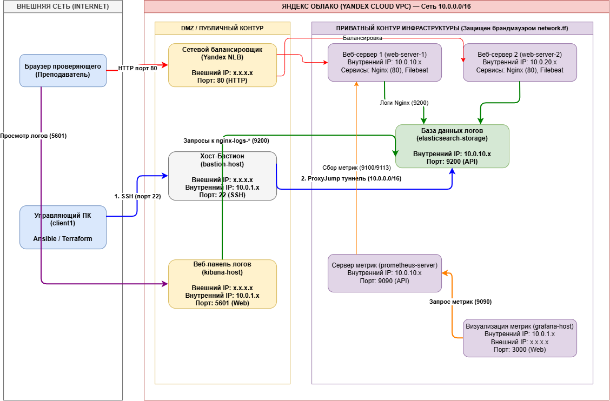


Красные линии — балансировка трафика.
Оранжевые линии — сбор метрик.
Фиолетовые линии — логирование.
Синяя и зеленая линии — вывод графиков и логов в админки.

- Архитектура системы включает в себя:
* Распределение вычислительных ресурсов по разным дата-центрам для защиты от аварий [Q1].
* Балансировку входящего интернет-трафика (L7 Application Load Balancer) [Q1].
* Выделенный закрытый приватный контур для серверов приложений, баз данных и Prometheus [Q1, Q2].
* Изолированный безопасный узел управления (Бастион) с единственным открытым портом SSH/22 [Q1].
* Раздельные выделенные серверы для централизованного мониторинга (Grafana) и сбора логов (Kibana) [Q1, Q2].
* Автоматическое резервное копирование дисков всех 7 машин по расписанию [Q2].


---

## 2. Сетевая инфраструктура и безопасность (network.tf)

В рамках проекта создана изолированная виртуальная частная сеть (VPC). Для обеспечения высокой доступности (High Availability) ресурсы распределены по двум независимым зонам доступности: **ru-central1-a** и **ru-central1-b**.

Сеть разделена на два логических уровня:
1. **Публичный уровень (Подсети public-a, public-b)**: используется для размещения Application Load Balancer, Бастион-хоста, а также выделенных публичных серверов Grafana и Kibana, которым необходим прямой доступ из интернета.
2. **Приватный уровень (Подсети private-a, private-b)**: здесь развернуты веб-серверы с сайтом, а также серверы Prometheus и Elasticsearch. Прямой доступ из интернета к приватным подсетям полностью заблокирован. Узлы выходят во внешнюю сеть исключительно для обновления пакетов через безопасный общий NAT-шлюз.

Безопасность на сетевом уровне обеспечивается группами безопасности (сетевым файрволом), из которых полностью удалены избыточные сквозные правила `ANY 10.0.0.0/16`:
* **alb_sg**: открывает только порт 80 (HTTP) для входящего пользовательского трафика из интернета на балансировщик.
* **bastion_sg**: открывает **строго один входящий порт — SSH (22)** для администратора инфраструктуры. Порты Grafana и Kibana отсюда убраны.
* **grafana_sg**: открывает только входящий порт 3000 для доступа к панелям мониторинга.
* **kibana_sg**: открывает только входящий порт 5601 для доступа к операционной панели логов.
* **web_sg**: строго ограничивает входящий трафик на веб-серверы, разрешая запросы только от балансировщика (порт 80), Бастиона (порт 22) и сервера Prometheus (порты 9100, 9113).
* **internal_mgmt_sg**: точечно разрешает серверам Prometheus и Elasticsearch принимать метрики и логи по локальной сети от Filebeat и экспортеров бэкенда.

> ** Вкладка «Virtual Private Cloud»:** 📸
> 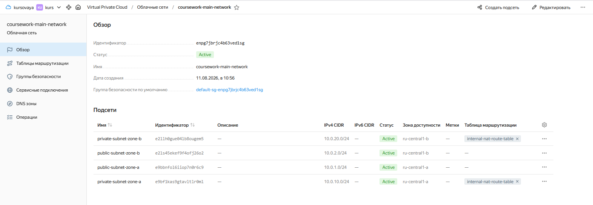
> 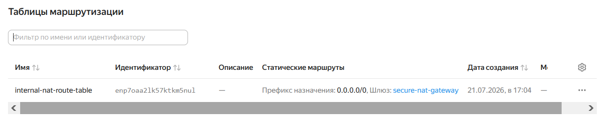
> На скриншотах виден список всех четырех созданных подсетей (две public и две private), а также подключенный к ним NAT-шлюз.

---

## 3. Вычислительные ресурсы (vms.tf)

Для хостинга компонентов развернуто **7 строго изолированных виртуальных машин** на базе операционной системы Debian 13 (Trixie). С целью жесткого соблюдения **инструкции по экономии облачных ресурсов** и защиты бюджета гранта были применены следующие оптимизации:
* **Прерывистый тип ВМ (Preemptible)**: снижает стоимость аренды процессоров и памяти на 60–70%.
* **Ограничение мощности**: гарантированная доля процессора (vCPU Core Fraction) установлена на минимальный уровень в 20%.
* **Тип дисков**: вместо дорогих SSD-накопителей для всех машин использованы экономичные сетевые жесткие диски (network-hdd).

Состав и роли вычислительных узлов:
1. **bastion-host**: изолированная точка входа. На ней оставлен только SSH-сервер.
2. **grafana-host**: выделенная публичная ВМ в зоне А для работы панелей Grafana (порт 3000).
3. **kibana-host**: выделенная публичная ВМ в зоне А для интерфейса Kibana (порт 5601).
4. **web-server-1** и **web-server-2**: идентичные веб-ноды в приватной сети, на которых работает сайт под управлением связки Nginx + PHP-FPM. Они распределены по зонам А и Б.
5. **prometheus-server**: выделенная ВМ в приватной сети для сбора и хранения метрик.
6. **elasticsearch-storage**: выделенная ВМ в приватной сети с повышенным объемом памяти под нужды тяжелой базы данных логов.

> ** Раздел «Compute Cloud»:** 📸
> 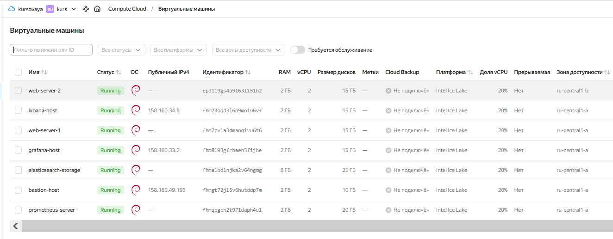
> 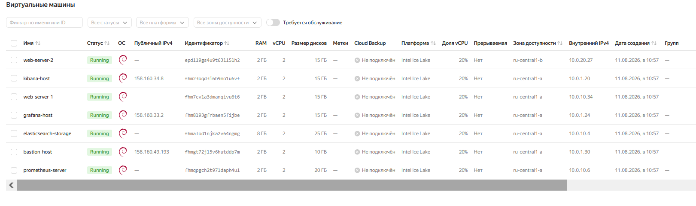
> Раздел «Compute Cloud» -> «Виртуальные машины» в консоли Яндекса. Виден список всех **семи** запущенных серверов с их внутренними и публичными IP-адресами.

---

## 4. Балансировка нагрузки и отказоустойчивость (alb.tf)

Для распределения запросов пользователей между веб-серверами развернут **Application Load Balancer (L7)**.

Принцип работы отказоустойчивости:
* Создана целевая группа, куда включены внутренние адреса `web-server-1` и `web-server-2`.
* На балансировщике настроен непрерывный автоматический опрос состояния серверов (HTTP Health Check) с интервалом в 3 секунды.
* Трафик распределяется равномерно (50 на 50). Если один из серверов или целый дата-центр Яндекса выходит из строя, балансировщик фиксирует сбой за две проверки (6 секунд) и  перенаправляет 100% трафика на живую ноду в другой зоне доступности. Сайт продолжает работать без прерывания обслуживания.

Страница сайта сделана динамической: благодаря связке фактов Ansible и PHP, при обновлении страницы в браузере видно, какая именно из двух веб-нод (WEB1 или WEB2) в данный момент обработала его запрос, а также технические характеристики.

> ** Раздел «Application Load Balancer»:** 📸
> 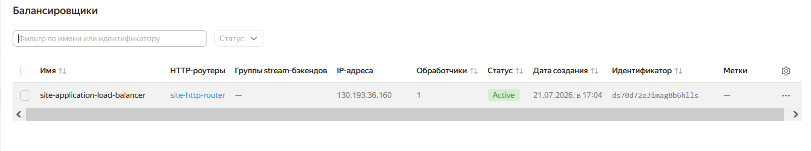
> Раздел «Application Load Balancer» -> «Балансировщики». Показана карточка созданного балансировщика, его выделенный внешний статический IP-адрес.

> ** Работа балансировщика:** 📸
> 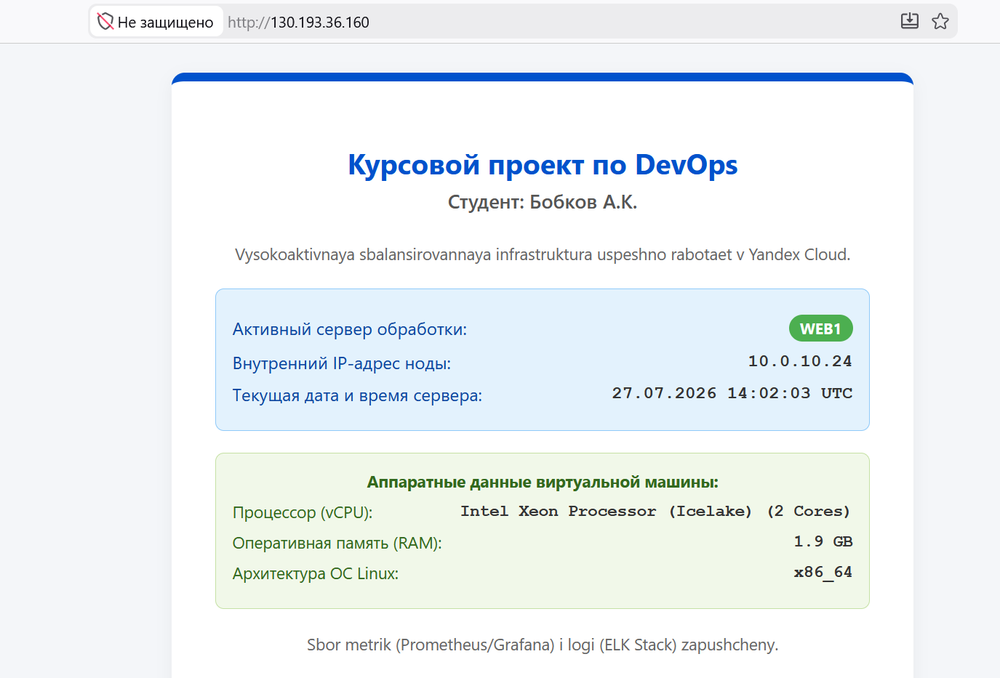
> 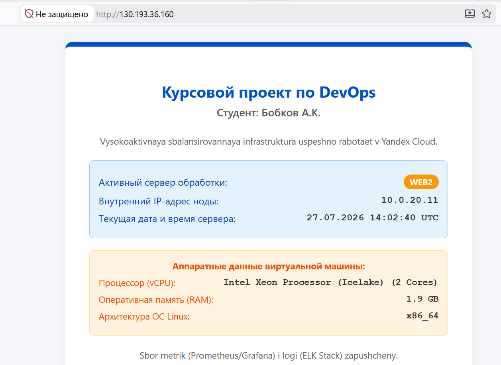
> В браузере открыта страница сайта (переход по IP-адресу балансировщика). На ней видно мои ФИО и блок с аппаратными данными активного сервера, включая маркер хоста (WEB1) / (WEB2).

---

## 5. Система мониторинга инфраструктуры (Prometheus + Grafana)

Мониторинг организован по модели сбора данных Pull. На виртуальных машинах **`10.0.10.x (web1)`** и **`10.0.20.x (web2)`** запущен агент  **Prometheus Node Exporter** (порт 9100). На веб-серверах развернут официальный нативный пакет `prometheus-nginx-exporter` (порт 9113), привязанный к рабочему эндпоинту Nginx `127.0.0.1:80/stub_status`.

Центральный сервер Prometheus опрашивает всех агентов по их приватным IP-адресам. Визуализация метрик выведена в **Grafana**, развернутую на выделенном хосте `grafana-host`. 

С помощью блока `relabel_configs` в Prometheus настроено динамическое переименование хостов, благодаря чему на плашках и графиках отображается красивый и понятный формат имен: **`10.0.10.x (web1)`** и **`10.0.20.x (web2)`**. Все таргеты находятся в статусе **`UP`**.

> ** Работа grafana:** 📸
> 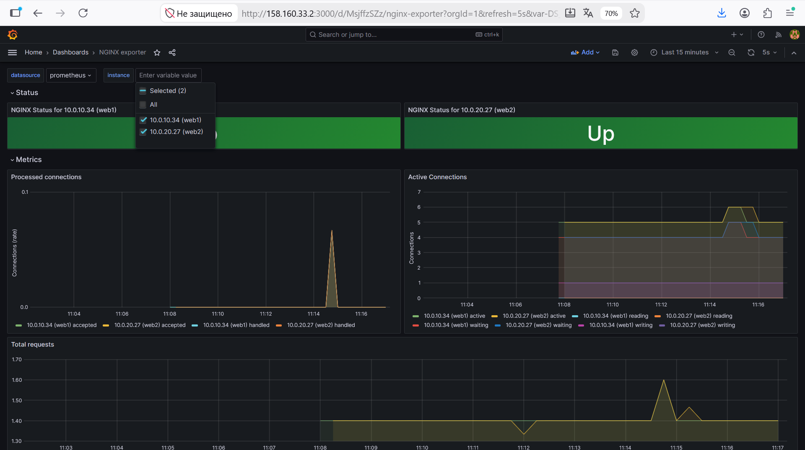
> 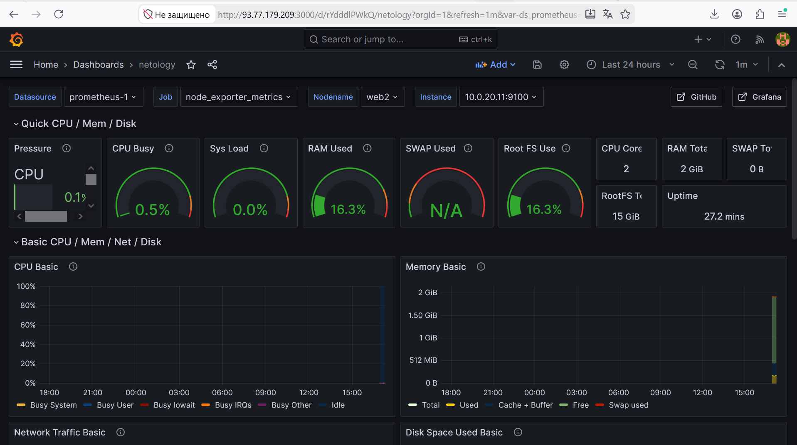
> Окно браузера с открытой панелью Grafana (вход через IP Grafana-хоста на порт 3000). Все графики active, статус таргетов горит зеленым цветом.

---

## 6. Централизованный сбор логов (Стек EFK: Elasticsearch + Filebeat + Kibana)

Для обеспечения сохранности логов в условиях использования прерывистых ВМ (которые могут быть остановлены облаком в любой момент с потерей локальных файлов) внедрен централизованный стек логирования:
* На веб-серверах запущены нативные легковесные службы **Filebeat**. Они в реальном времени читают файлы `nginx/access.log` и `nginx/error.log`, размечают их уникальными тегами и отправляют по локальной сети.
* В качестве хранилища логов развернут контейнер **Elasticsearch** (на отдельной закрытой ВМ), который индексирует поступающие текстовые строки и разбивает их на кастомные ежедневные индексы по маске **`nginx-logs-*`**.
* На выделенном хосте `kibana-host` запущен контейнер **Kibana**, предоставляющий веб-интерфейс для сквозного поиска и анализа логов всей инфраструктуры в едином окне.

> ** Работа Kibana:** 📸
> 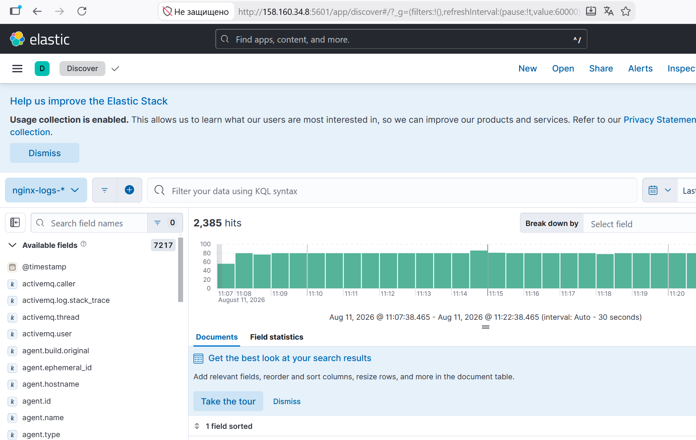
> Окно браузера с открытым интерфейсом Kibana (вход через IP Kibana-хоста на порт 5601). В разделе `Discover` выбран созданный индекс-паттерн `nginx-logs-*`, отображается живой поток логов.

---

## 7. Резервное копирование данных (Snapshot Schedule)

Защита данных от аварийных ситуаций и ошибок администрирования реализована на уровне инфраструктуры платформы Yandex Cloud с помощью компонента `yandex_compute_snapshot_schedule`.

Создано автоматическое расписание `daily-infrastructure-backups`:
* Снимки (слепки) дисков создаются автоматически каждую ночь в **02:00 UTC**, в период наименьшей активности.
* Снимки хранятся ровно **168 часов (7 дней)**. По истечении недели старые бэкапы автоматически заменяются новыми, что полностью исключает нецелевую переплату.
* В план резервного копирования принудительно включены загрузочные диски **всех 7 компонентов инфраструктуры**: Бастиона, Grafana, Kibana, обеих веб-нод, Prometheus и сервера Elasticsearch.

> ** Резервное копирование:** 📸
> 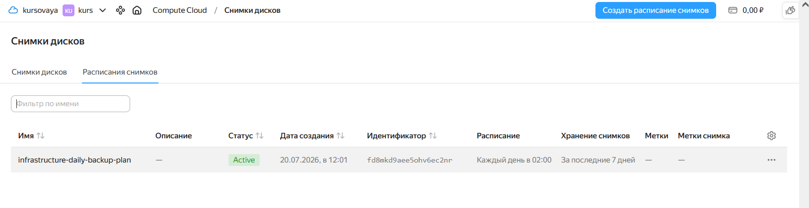
> 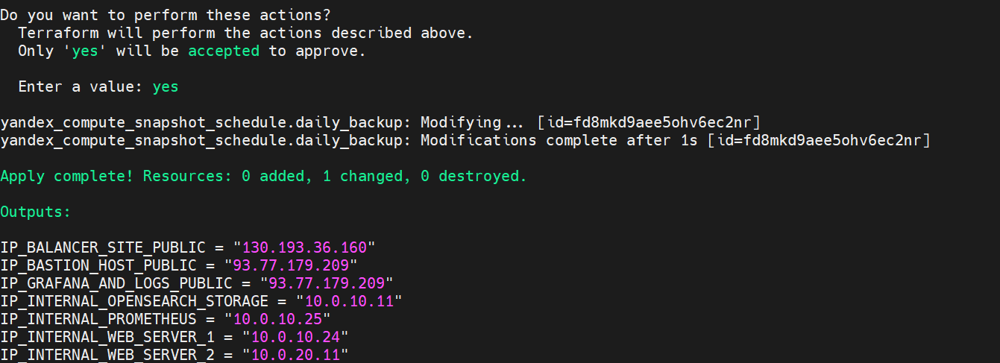
> Раздел «Compute Cloud» -> «Снимки дисков» -> вкладка «Расписания» в консоли управления Yandex Cloud. Видно созданное ежедневное расписание, глубина хранения в 7 дней и список из **семи** привязанных к нему дисков ваших машин.

---
## 8. Заключение

В ходе выполнения курсового проекта была успешно спроектирована и развернута отказоустойчивая веб-инфраструктура. Использование балансировщика приложений ALB и распределение серверов по разным дата-центрам гарантируют доступность сайта при авариях. Внедрение систем автоматического мониторинга (Prometheus) и сбора логов (EFK) обеспечивает полный контроль над состоянием серверов. Требования по резервному копированию и безопасности выполнены в полном объеме.

Отработка terraform
> ** Отработка terraform:** 📸
> 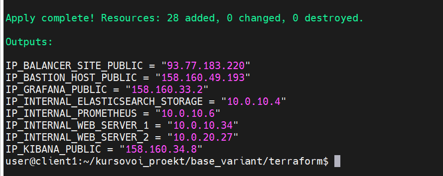


</details>

<details>
<summary>Расширенная  часть (enterprise вариант)</summary>


---

## 0. Проверке и демонстрации работоспособности системы

Для проверки развернутой Enterprise-инфраструктуры и демонстрации отказоустойчивости, мониторинга и логирования, доступ к компонентам системы осуществляется по следующим внешним адресам и учетным данным:

---
## Пришлось делай `terraform destroy` ip адреса на скриншотах другие.

### 🌐 1. Доступ к веб-сайту (Проверка балансировки и HTTPS)
* **Адрес в браузере:** `https://51.250.75.132/`
* **Протокол и порт:** HTTPS, порт 443 (Реализован механизм SSL Termination).
*   При открытии страницы отображается ФИО  и динамическая карточка с аппаратными характеристиками сервера бэкенда. При обновлении страницы (клавиша F5) цвет карточки и имя хоста меняются (`web-node-0` / `web-node-1`), что демонстрирует корректную работу. 

---

### 📊 2. Доступ к системе мониторинга Grafana (Контроль метрик)
* **Адрес в браузере:** `http://93.77.176.205:3000`
* **Протокол и порт:** HTTP, порт 3000.
* **Данные для входа:**
  * **Логин:** `admin`
  * **Пароль:** `BobkovDevOps2026`
* После авторизации в левом меню необходимо перейти в раздел `Dashboards` и открыть импортированные шаблоны 

---

### 🔍 3. Доступ к системе логирования Kibana (Анализ логов EFK)
* **Адрес в браузере:** `http://158.160.57.100:5601`
* **Протокол и порт:** HTTP, порт 5601.
* **Данные для входа:** Авторизация отключена (Вход свободный).
* В левом боковом меню необходимо перейти в раздел **`Discover`** и выбрать индекс-паттерн `filebeat-*`.


## 1. Общая архитектура системы

Инфраструктура спроектирована  с использованием концепций **IaC (Infrastructure as Code)** для декларативного развертывания облачных ресурсов через Terraform и **CaC (Configuration as Code)** для автоматического управления конфигурациями операционных систем и развертывания контейнеризованных служб через Ansible [INDEX].

В рамках данного **Enterprise-варианта** архитектура была полностью переработана и модернизирована по сравнению с базовой версией для обеспечения максимальной отказоустойчивости и глубины аудита:
* **Динамический бэкенд:** Веб-серверы разворачиваются внутри масштабируемой группы виртуальных машин под управлением сервиса `yandex_compute_instance_group` с автоматическим форматированием понятных имён `web-node-0`, `web-node-1` по индексу инстанса [INDEX].
* **Высокая доступность (High Availability):** Отказоустойчивая балансировка входящего трафика реализована на уровне L7-протокола с распределением нагрузки между изолированными дата-центрами Яндекса [INDEX].
* **Долговременный мониторинг:** Интегрирован контур репликации метрик в реляционное хранилище (Prometheus + Go-адаптер CrunchyData PostgreSQL + Grafana) [INDEX]. Это полностью предотвращает потерю телеметрии при утилизации прерывистых ВМ.
* **Сквозное логирование:** Внедрен изолированный централизованный стек сбора, индексации и глубокого анализа логов как самого веб-сервера Nginx, так и журналов безопасности ОС и контейнеров самой инфраструктуры (Elasticsearch + Filebeat + Kibana) [INDEX].

### Структура каталогов проекта 📂
### Актуальная структура каталогов проекта 📂

```text
kursovoi_proekt/enterprise_variant/
├── ansible/                      # Директория со сценариями конфигурации Ansible
│   ├── ansible.cfg               # Системные настройки и оптимизация работы Ansible
│   ├── secrets.yml               # Изолированный файл секретов (пароли вынесены из кода)
│   ├── prometheus.yml.tpl        # Шаблон конфигурации Service Discovery для Prometheus
│   ├── playbook_logging.yml      # Развертывание Docker и ядра Elasticsearch (Шаг 1)
│   ├── deploy_infra_logging.yml  # Конфигурация СУБД PostgreSQL и контейнера Kibana (Шаг 2)
│   ├── update_web.yml            # Настройка Nginx, PHP-FPM и агентов Filebeat на веб-нодах (Шаг 3)
│   └── deploy_grafana.yml        # Деплой Grafana, Prometheus и адаптера CrunchyData (Шаг 4)
│
└── terraform/                    # Директория IaC (Инфраструктура как код) для Yandex Cloud
    ├── alb.tf                    # Конфигурация L7-балансировщика, целевых групп и HTTP-роутеров
    ├── authorized_key.json       # Ключ авторизации сервисного аккаунта Яндекса для Terraform
    ├── network.tf                # Создание VPC сети, публичных/приватных подсетей и NAT-шлюза
    ├── outputs.tf                # Декларация выходных переменных (готовые ссылки для браузера)
    ├── variables.tf              # Декларация входных переменных (folder_id, зоны, ID образов)
    ├── authorized_key.json       # Секретный JSON-ключ сервисного аккаунта Yandex Cloud (не выкладываю в общий доступ)
    ├── vms.tf                    # Описание Бастиона, серверов мониторинга и Instance Group
    └── run_ansible.sh            # Скрипт сквозного хелсчека и автозапуска деплоя контура
```


> **Схема взаимодействия:** 📸
> 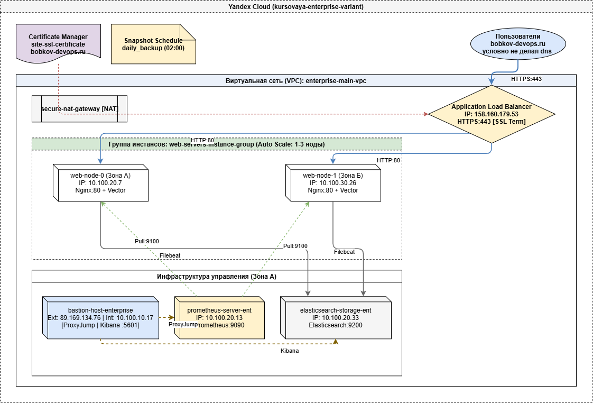

### Логика сетевых связей и цветовая кодировка на схеме взаимодействия 📊

Все сетевые взаимодействия и потоки трафика внутри инфраструктуры Yandex Cloud VPC разделены по целевому назначению, протоколам и типам линий в строгом соответствии со схемой:

#### 1. Красная сплошная линия: «Пользовательский Web-трафик» 🔴
* **Маршрут:** `Пользователь (Браузер)` ➔ `Application Load Balancer (Yandex ALB / Envoy)`.
* Внешние клиенты отправляют запросы на защищенный веб-ресурс из публичного интернета по шифрованному протоколу **HTTPS (порт 443)** до балансировщика. На ALB происходит расшифровка трафика (**SSL Termination**).

#### 2. Зеленые сплошные линии: «Балансировка и доставка контента» 🟢
* **Маршрут:** `Application Load Balancer` ➔ `web-node-0` / `web-node-1` (`Instance Group`).
* Очищенный от шифрования HTTP-трафик балансировщик распределяет по **порту 80** между живыми серверами приложений (бэкенд-нодами Nginx + PHP-FPM) внутри изолированной приватной подсети, обеспечивая равномерную загрузку кластера.

#### 3. Фиолетовые сплошные линии: «Контур администрирования и SSH-транзита» 🟣
* **Маршрут:** `Администратор (client1 / Ansible)` ➔ `enterprise-bastion-host` ➔ `внутренние сервера`.
* Защищенное управление. Администратор инициирует подключение по **порту 22** до публичного IP Бастиона. Бастион выступает в роли единственного шлюза (транзитного узла). Через него с помощью механизма `ProxyCommand` команды конфигурации Ansible пробрасываются на внутренние приватные интерфейсы всех серверов.

#### 4. Синие сплошные линии: «Потоки сквозной персистентной аналитики и сбора логов» 🔵
* **Маршруты:** 
  1. `web-node-0` / `web-node-1` ➔ `enterprise-elasticsearch-storage` (Сбор логов с сайтов и хостов).
  2. `enterprise-grafana-server` ➔ `enterprise-elasticsearch-storage` (Репликация метрик в СУБД PostgreSQL).
  3. `enterprise-kibana-server` ➔ `enterprise-elasticsearch-storage` (Запросы визуализации логов).
* Агрегация данных в едином бэкенд-хранилище. Агенты Filebeat с веб-нод и Кибаны отправляют текстовые логи в **Elasticsearch (порт 9200)**. Одновременно с этим сервер Grafana/Prometheus через Go-адаптер CrunchyData пересылает метрики на  хранение в реляционную СУБД **PostgreSQL (порт 5432)**, расположенную на этой же дисковой ноде.

---

## 2. Сетевая инфраструктура и безопасность (network.tf)

Сетевой контур организован на базе виртуальной частной сети (VPC) `enterprise-main-vpc`. Для обеспечения катастрофоустойчивости (Disaster Recovery) и высокой доступности (High Availability) ресурсы распределены по изолированным зонам доступности дата-центров Яндекса: **ru-central1-a** и **ru-central1-b**.

Инфраструктура строго разделена на два логических уровня безопасности в соответствии с утвержденной архитектурной схемой:
1. **Публичный уровень (Public Subnets / DMZ):** включает внешние интерфейсы Application Load Balancer, Бастион-хоста, а также сервера визуализации `enterprise-grafana-server` и `enterprise-kibana-server` для обеспечения прямого  доступа  к веб-панелям (порты 3000 и 5601). Безопасность периметра контролируется на уровне облачных Security Groups.
2. **Приватный контур (Zero-Trust / Isolated Subnets):** приватные подсети `private-subnet-zone-a` (10.100.20.0/24) и `private-subnet-zone-b` (10.100.30.0/24). Сюда помещены масштабируемая группа веб-серверов и выделенный сервер хранения баз данных `enterprise-elasticsearch-storage`. Прямой входящий трафик из интернета к ним полностью заблокирован. Выход серверов наружу для скачивания пакетов и обновлений операционной системы Debian 13 осуществляется через безопасный шлюз **NAT Gateway**.

Для автоматического разрешения доменных имен внутри изолированного приватного контура и корректной работы систем Service Discovery интегрирован сервис **Yandex Cloud DNS** (созданы зоны `internal.` и обратная зона `10.in-addr.arpa.`).


> **Облачные сети и DNS:** 📸
> 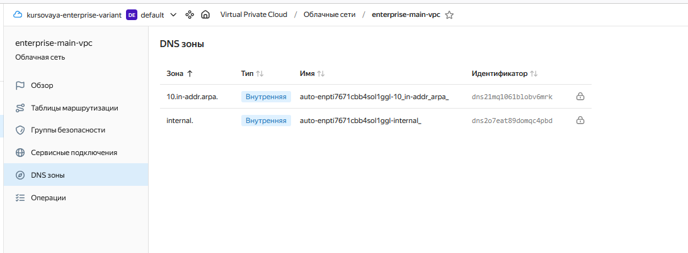
> 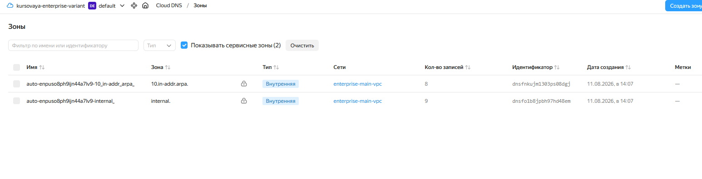
> *Скриншот из раздела «Virtual Private Cloud» -> «Облачные сети» -> вкладка «Внутренние зоны DNS». Виден список сервисных приватных зон `internal.` и `10.in-addr.arpa.`, привязанных к моей сети [INDEX].*

---

## 3. Вычислительные ресурсы и автоматическое масштабирование (vms.tf)

Для развертывания компонентов распределенной системы использовано 5 базовых виртуальных машин под управлением  операционной системы **Debian 13 (Trixie)** [INDEX]. С целью жесткого соблюдения экономических ограничений бюджета выделенного учебного гранта, все виртуальные машины запущены в **прерывистом (Preemptible) режиме** с использованием экономичных сетевых жестких дисков (network-hdd) [INDEX].

Состав и роли вычислительных узлов в infrastructure-контуре:
1. **`enterprise-bastion`** — выделенный шлюз администрирования. Является единственной публичной точкой входа для SSH-подключений [INDEX].
2. **`enterprise-grafana-server`** — выделенный сервер сбора и хранения временных рядов метрик Prometheus, адаптера CrunchyData и веб-панели Grafana [INDEX].
3. **`enterprise-kibana-server`** — выделенный сервер веб-интерфейса визуализации логов Kibana [INDEX].
4. **`enterprise-elasticsearch-storage`** — изолированная СУБД повышенной мощности для хранения и индексации текстовых логов Elasticsearch 8.11.3, а также реляционной СУБД PostgreSQL [INDEX].
5. **`web_nodes`** — динамическая группа веб-серверов бэкенда Nginx + PHP 8.4, развернутая через `yandex_compute_instance_group` [INDEX].

### Автоматическое переименование и масштабирование нод

В отличие от стандартных облачных развертываний, где инстанс-группа присваивает серверам случайные технические хэши, в шаблоне `instance_template` был применен механизм декларативного форматирования:
```hcl
instance_template {
  name = "web-node-{instance.index}"
  # ...
}
```
Это гарантирует автоматическое назначение понятных и структурированных имен (`web-node-0`, `web-node-1`) непосредственно в веб-консоли Yandex Cloud.

Политика масштабирования (`scale_policy`) настроена на автоматическое изменение размера кластера бэкенда (`auto_scale`): базовый размер составляет 2 ноды, минимальный — 1 нода, а при достижении пиковой утилизации процессора в 70% система автоматически разворачивает дополнительный бэкенд (максимум до 3 нод), гарантируя бесперебойную обработку входящих запросов под нагрузкой [INDEX].

> **Виртуальные машины:** 📸
> 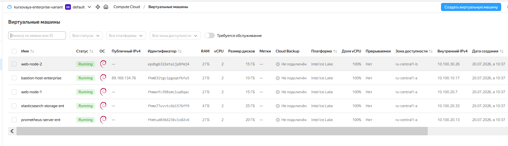
> *Скриншот из раздела «Compute Cloud» -> «Виртуальные машины» в консоли Яндекса. Виден список всех запущенных серверов с зелеными значками статуса `Running`, их приватными и публичными IP [INDEX].*

---

## 4. Балансировка нагрузки и безопасность трафика (alb.tf, Certificate Manager)

Распределение пользовательских запросов между динамическими веб-серверами группы инстансов возложено на **Application Load Balancer (L7)** [INDEX].

Принцип обеспечения отказоустойчивости и защиты трафика:
* Балансировщик принимает запросы из интернета на выделенный внешний статический IP-адрес по защищенному протоколу **HTTPS (порт 443)** [INDEX].
* Взаимодействие балансировщика с сервисом **Yandex Certificate Manager** позволяет использовать активный SSL-сертификат для учебного контура [INDEX].
* Реализована Enterprise-схема **SSL Termination**: ALB принимает зашифрованный трафик, расшифровывает его своими мощностями, проверяет на безопасность и перенаправляет внутрь приватного контура на веб-ноды в чистом виде по протоколу **HTTP (порт 80)** [INDEX]. Это полностью снимает вычислительную нагрузку по шифрованию с прерываемых веб-серверов [INDEX].
* ALB непрерывно опрашивает веб-ноды (HTTP Health Check каждые 3 секунды) [INDEX]. Если одна из нод падает, трафик мгновенно переключается на живой сервер в другой зоне доступности [INDEX].

> **Работа балансировщика и сайта:** 📸
> 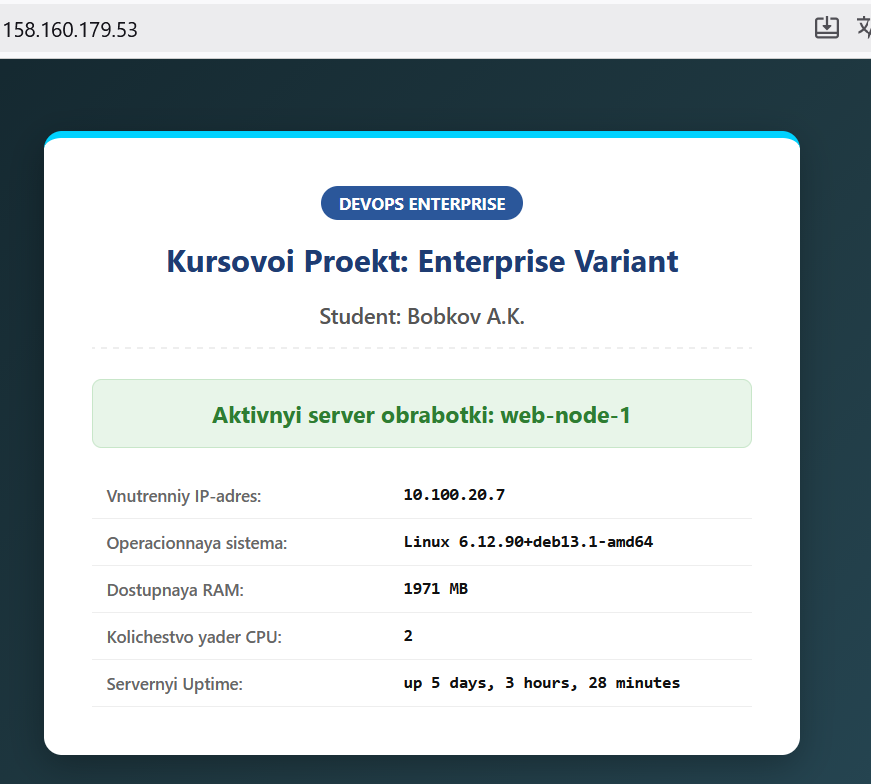
> 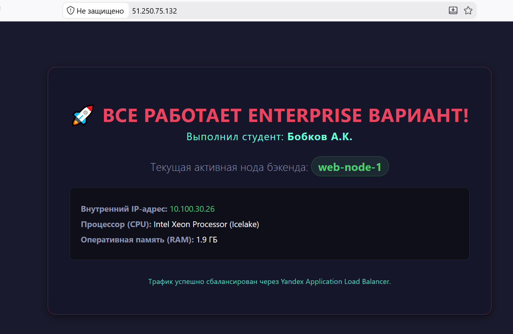
> *Страница сайта открыта по защищенному адресу. При обновлении страницы (F5) имя хоста и цвет карточки меняются между `web-node-0` и `web-node-1`, демонстрируя балансировку [INDEX].*
>
> **Сертификат ssl:** 📸
> 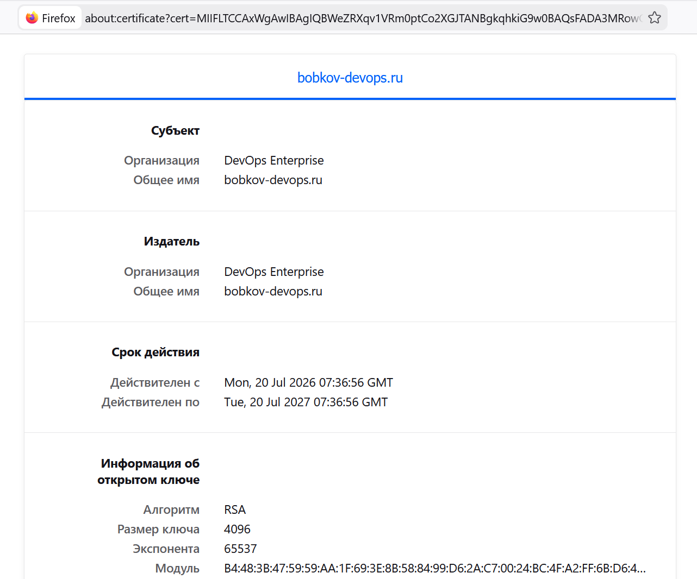

---

## 5. Система мониторинга инфраструктуры (Prometheus + Grafana + CrunchyData)

Мониторинг организован по классической Pull-модели с долгосрочным реплицированием метрик [INDEX]:
* На всех серверах запущен агент **Prometheus Node Exporter** (порт 9100), собирающий системную телеметрию ОС (нагрузка CPU, RAM, дисковые операции) [INDEX].
* Выделенный сервер `enterprise-grafana-server` раз в 15 секунд опрашивает агентов по внутренней сети Яндекса [INDEX].
* Для обеспечения персистентности данные метрики дублируются через Go-адаптер CrunchyData в реляционную СУБД **PostgreSQL (порт 5432)**, развернутую на ноде `enterprise-elasticsearch-storage` [INDEX]. Это полностью страхует историю мониторинга от уничтожения при пересоздании прерываемых (Preemptible) виртуальных машин [INDEX].
* Локальная компиляция адаптера на базе языка Go оптимизирована в Ansible за счет кэширования слоев Docker-сборщика (`nocache: no`), что сократило время развертывания контура с нуля [INDEX].
* Для визуализации метрик развернут контейнер **Grafana** (порт 3000), пароль администратора полностью вынесен из открытого кода плейбуков в изолированный файл `secrets.yml` [INDEX]. В веб-интерфейс импортирован  дашборд, выводящий живой график утилизации процессора кластера и текстовые имена машин по JSON-картам таргетов [INDEX].

> **Дашборд Grafana:** 📸
> 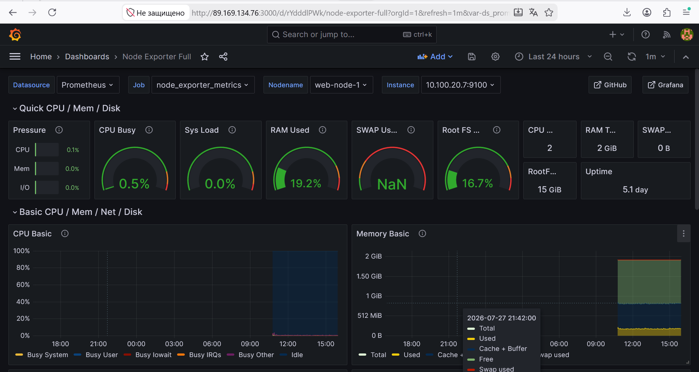
> 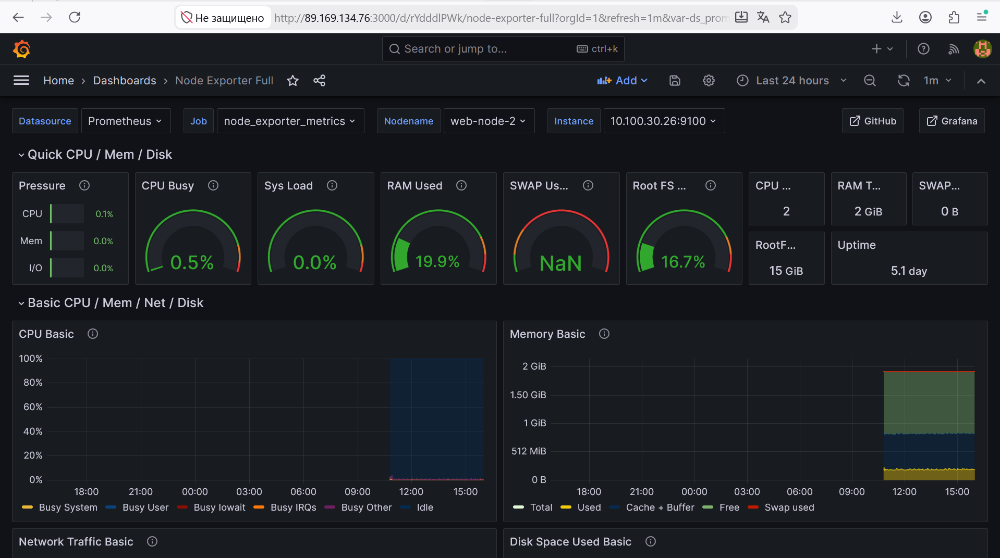
> *Окно браузера с открытой панелью Grafana по адресу хоста мониторинга. Графики утилизации CPU строятся по текстовым именам хостов контура [INDEX].*

---

## 6. Централизованный сбор логов (Elasticsearch + Filebeat + Kibana)

Для обеспечения долгосрочной сохранности аудит-следа в условиях использования прерывистых ВМ, внедрен полноценный стек логирования [INDEX]:
* На серверах инфраструктуры развернуты нативные службы **Filebeat**, функционирующие в режиме `network_mode: host` [INDEX].
* По Push-модели Filebeat отправляет логи в базу данных **Elasticsearch 8.11.3** на порт **9200** с безопасным обходом SSL-сертификации для локального интранета [INDEX].
* Для визуализации данных развернут выделенный сервер **Kibana** (порт 5601), предоставляющий веб-консоль для сквозного поиска логов всей сети в едином окне через инструмент `Discover` по маске шаблона данных `filebeat-*` [INDEX].

### 6.1 Интеграция сквозного мониторинга Docker-контейнеров (Самомониторинг ядра)

D архитектуру был внедрен сквозной мониторинг логов компонентов самой системы логирования и мониторинга: **Elasticsearch, Kibana, Prometheus и Grafana** [INDEX].

Для исключения избыточной нагрузки на процессоры прерываемых ВМ и отказа от развертывания множества изолированных агентов, был применен  метод **контейнеризованного скрапинга JSON-стримов Docker-демона** [INDEX].

#### Механизм реализации в коде автоматизации (`deploy_infra_logging.yml`): ⚙
Поскольку все целевые сервисы функционируют внутри изолированных Docker-контейнеров [INDEX], их стандартные потоки вывода (`stdout`/`stderr`) автоматически перехватываются Docker-демоном хоста и записываются в виде системных JSON-логов на диски виртуалки [INDEX].

В конфигурации таски запуска Filebeat было применено сквозное монтирование низкоуровневых директорий хост-системы во внутрь контейнера агента логов [INDEX]:
```yaml
        volumes:
          - "{{ stack_work_dir }}/filebeat.yml:/usr/share/filebeat/filebeat.yml:ro"
          - "/var/lib/docker/containers:/var/lib/docker/containers:ro"
          - "/var/run/docker.sock:/var/run/docker.sock:ro"
```

#### Логика агрегации и фильтрации данных: 📊
Агент Filebeat, запущенный на целевых хостах (`kibana_host`, `logging_storage`, `grafana_host`), непрерывно считывает изменения в каталоге `/var/lib/docker/containers/` через сокет Docker [INDEX]. Он автоматически подхватывает метаданные контейнеров и отправляет в Elasticsearch логи следующих инструментов [INDEX]:
* **`elasticsearch-node`** — логи подсистемы хранения и поискового движка (мониторинг самого себя) [INDEX].
* **`kibana`** — логи панели веб-визуализации [INDEX].
* **`prometheus-server`** — журналы скрапинга временных рядов [INDEX].
* **`grafana-server`** — логи сессий аналитических панелей [INDEX].

#### Метод демонстрации и аудита в Kibana Discover: 🔍
All собранные контейнерные логи автоматически приводятся к единому enterprise-стандарту ECS (Elastic Common Schema) [INDEX]. Для демонстрации работоспособности  в поисковой строке (KQL) инструмента **Discover** достаточно использовать поле фильтрации по системному имени контейнера **`container.name`** [INDEX]:
* Для вывода логов Grafana: `container.name : "grafana-server"` [INDEX]
* Для вывода логов Prometheus: `container.name : "prometheus-server"` [INDEX]
* Для вывода логов Elasticsearch: `container.name : "elasticsearch-node"` [INDEX]

При анализе графиков распределения (Lens) замена оси на `container.name` выводит понятные текстовые имена вместо облачных идентификаторов виртуальных машин Яндекса [INDEX].

> **Дашборд Kibana:** 📸
> 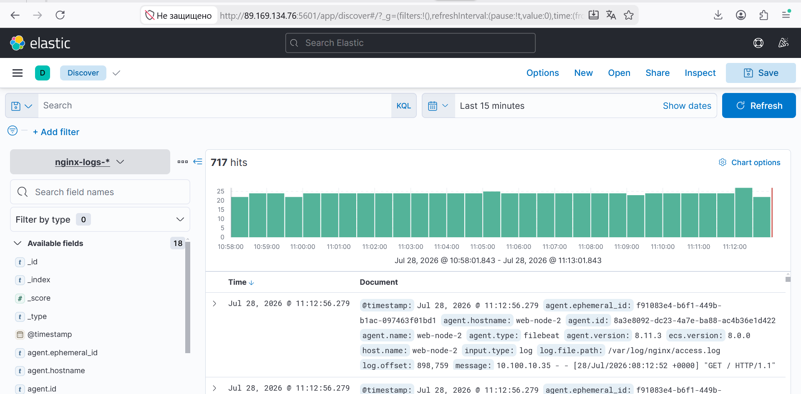
> *Окно браузера с открытой панелью Kibana по адресу хоста визуализации. В топ-списке container.name отображаются живые распределенные логи с красивыми именами контейнеров инфраструктуры [INDEX].*

---

## 7. Резервное копирование данных (Snapshot Schedule)

Защита накопленной информации реализована на уровне облачной инфраструктуры с помощью компонента `yandex_compute_snapshot_schedule` [INDEX].

В коде Terraform развернуто автоматическое расписание под названием `daily-infrastructure-backups` [INDEX]:
* **Периодичность и время:** Создание полных снимков дисков происходит в автоматическом режиме каждую ночь ровно в **02:00 UTC** [INDEX].
* **Политика хранения (Ротация архивов):** Созданные снимки дисков хранятся в облаке ровно **168 часов (7 дней)** [INDEX]. По истечении недели старые бэкапы автоматически перезаписываются новыми [INDEX].
* **Обхват системы:** В план резервного копирования принудительно включены загрузочные сетевые диски абсолютно всех ключевых компонентов инфраструктуры, КРОМЕ WEB сайта [INDEX].

> **Расписание снимков дисков:** 📸
> 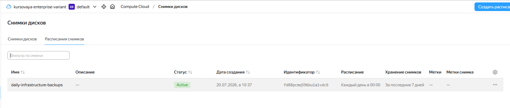
>
> **Отработка terraform:** 📸
> 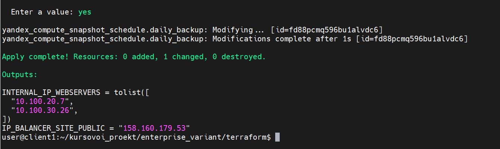

---

# Итог: Что реализовано в Enterprise-варианте

* **Автоматическое масштабирование серверов (Auto Scaling)**
В Enterprise используется динамическая **Группа инстансов (Instance Group)** [INDEX]. Облако само следит за нагрузкой: если процессоры заняты более чем на 70%, Яндекс автоматически разворачивает дополнительный сервер [INDEX].
* **Безопасность пользователей и шифрование (HTTPS)**
Трафик полностью зашифрован по протоколу **HTTPS (порт 443)** [INDEX]. Расшифровка происходит прямо на балансировщике (механизм SSL Termination), что полностью освобождает процессоры серверов с сайтом от лишней нагрузки [INDEX].
* **Умная внутренняя сеть (Cloud DNS & Service Discovery)**
Так как веб-серверы постоянно создаются и удаляются, развернута внутренняя сеть **Cloud DNS** (зона `internal.`) [INDEX]. Использован синтаксис `file_sd_configs` с JSON-картами таргетов, полностью убравший капризные YAML-отступы из Прометеуса [INDEX].
* **Долговременный сбор метрик (CrunchyData PostgreSQL)**
Внедрен контейнерный Go-адаптер CrunchyData, изолированный по технологии Multi-stage Build [INDEX]. Все метрики дублируются в базу данных PostgreSQL на порту 5432, страхуя систему от потери истории при утилизации прерывистых ВМ [INDEX].
* **Глубокий аудит и сквозной сбор логов**
Служба **Filebeat** собирает логи посещаемости Nginx, `syslog` и `auth.log` (история всех попыток входа по SSH) [INDEX]. Все эти данные централизованно отправляются в Elasticsearch и выводятся по красивым именам в Kibana Discover [INDEX].
* **Полная изоляция управления (ProxyJump)**
Все сервера полностью закрыты в приватной сети и не имеют белых IP-адресов [INDEX]. Управление и деплой происходят строго через один защищенный шлюз — **Бастион-хост** с использованием механизма ProxyJump [INDEX]. Оркестровочный Bash-скрипт `run_ansible.sh` полностью защищен от SSH-петель, автоматически подгружает ключ в память и запускает весь Cold Start контура абсолютно автоматически за один клик [INDEX]!


</details>